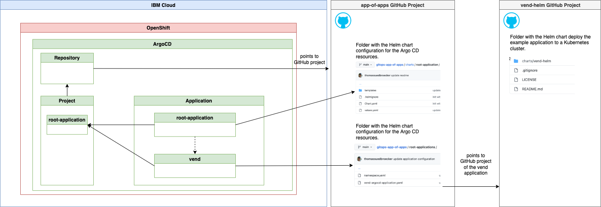

# gitops-app-of-apps

This is an example to setup an [app-of-apps pattern in ArgoCD](https://argo-cd.readthedocs.io/en/stable/operator-manual/cluster-bootstrapping/).

The readme is organized in th following sections:

1. Simplified architecture overview
2. Understand the `"app-of-apps"` Argo CD configuration for the example
3. Deploy the example app-of-apps with Helm
4. Verify the example app-of-apps

## 1. Simplified architecture overview

That is a simplified architecture overview



As a starting point we are using the blog post called ["Use Software Everywhere and IasCable to setup GitOps on a Red Hat OpenShift Cluster in a Virtual Private Cloud on IBM Cloud"](https://wp.me/paelj4-1tZ) to configure and setup the needed following resources. 

* IBM Cloud 
* Red Hat OpenShift in a VPC is setup
* Argo CD is setup and initial gitops bootstap is configured

And we are going to use ...

* ... two existing GitHub repositories:

    * One GitHub repository for the Argo CD configurations
    * One GitHub repository for the example application called vend

* ... Helm to the `app-of-apps` the `vend example` application to our cluster

    The images shows create Argo CD resoucres later.
    

* ... folder `"root-applications"` contains the CD configuration yaml for new applications. In our case we have saved the application configuration for the `example vend app` in the `"root-applications"` folder.

> Note: In current example we won't use the [pre-configured bootstap resoures](https://github.com/cloud-native-toolkit/terraform-tools-gitops) for Argo CD resources, created by the [Software Everywhere](https://github.com/cloud-native-toolkit/software-everywhere) module called [terraform-tools-gitops](https://github.com/cloud-native-toolkit/terraform-tools-gitops).

## 2. Understand the `"app-of-apps"` Argo CD configuration for the example

### a) Repository

```yaml
apiVersion: v1
kind: Secret
metadata:
  name: {{ .Values.repository_metadata_name }}
  namespace: {{ .Values.repository_metadata_namespace }}
  labels:
    argocd.argoproj.io/secret-type: repository
stringData:
  type: git
  url: {{ .Values.repository_stringData_url }}
```

Relevant values for the repository in the Helm `values.yaml` file.

```yaml
repository_metadata_name:  "github.com-thomassuedbroecker-gitops-app-of-apps"
repository_metadata_namespace: "openshift-gitops"
repository_stringData_url: "https://github.com/thomassuedbroecker/gitops-app-of-apps"
```

### b) Project

```yaml
apiVersion: argoproj.io/v1alpha1
kind: AppProject
metadata:
  name: {{ .Values.project_metadata_name }}
  namespace: {{ .Values.project_metadata_namespace }}
spec:
  clusterResourceWhitelist:
    - group: '*'
      kind: '*'
  description: This is just an root-project example.
  destinations:
    - name: {{ .Values.project_destination_name }}
      namespace: '*'
      server: {{ .Values.project_destination_server }}
  namespaceResourceWhitelist:
    - group: '*'
      kind: '*'
  sourceRepos:
    - '*'
status: {}
```

Relevant values for the repository in the Helm `values.yaml` file.

Let us have a short look at some of the values:

1. `project_destination_namespace`: Here we reuse the exising `"openshift-gitops"` namespace.
2. `project_destination_namespace`: We allow all namespases `"*"` as destination namespaces.
3. `project_destination_name`: We configure only `"in-custer"` as a valid cluser
4. `project_source_repo_url`: We configure our repository, where we are going to search for new applications to deploy.

```yaml
project_metadata_name:  "root-application"
project_metadata_namespace: "openshift-gitops"
project_destination_namespace: "*"
project_destination_name: "in-cluster"
project_destination_server: "https://kubernetes.default.svc"
project_source_repo_url: "https://github.com/thomassuedbroecker/gitops-app-of-apps"
```

### c) `app-of-apps` Application 

This is the `app-of-apps` application configuration.We call the configuration in our situation the application `root-application`.

The image below shows a later stage, when we sync all resources.


The application is not defined as a specific type deployment types like helm for example.

It just contains the information:

* Related Argo CD project
* Destination information 
* Source information

```yaml
apiVersion: argoproj.io/v1alpha1
kind: Application
metadata:
  name: {{ .Values.application_metadata_name }}
  namespace: {{ .Values.application_metadata_namespace }}
spec:
  destination:
    name: {{ .Values.application_destination_name }}
    namespace: {{ .Values.application_destination_namespace }}
  project: {{ .Values.application_project }}
  source:
    path: {{ .Values.application_source_path }} 
    repoURL: {{ .Values.application_source_repo_url }}
    targetRevision: HEAD
  syncPolicy:
    retry:
      backoff:
        duration: 5s
        factor: 2
        maxDuration: 3m0s
      limit: 2
```

```yaml
application_metadata_name:  "root-application"
application_metadata_namespace: "openshift-gitops"
application_destination_namespace: "openshift-gitops"
application_destination_name: "in-cluster"
application_project: "root-application"
application_source_repo_url: "https://github.com/thomassuedbroecker/gitops-app-of-apps"
application_source_path: "root-applications"
```

### d) `example vend` Application

The following configuration of the application contains the link to GitHub repo for with the helm chart to deploy the example vend application.

```yaml
apiVersion: argoproj.io/v1alpha1
kind: Application
metadata:
  name: vend
  namespace: openshift-gitops
  finalizers:
  - resources-finalizer.argocd.argoproj.io
spec:
  destination:
    name: in-cluster
    namespace: openshift-gitops
  project: root-application
  source:
    helm:
      valueFiles:
        - values.yaml
    path: "charts/vend-helm"
    repoURL: "https://github.com/thomassuedbroecker/vend-helm"
    targetRevision: HEAD
  syncPolicy:
    retry:
      backoff:
        duration: 5s
        factor: 2
        maxDuration: 3m0s
      limit: 2
```

## 3. Deploy the example with Helm

### Step 1: Clone the project

```sh
git clone https://github.com/thomassuedbroecker/gitops-app-of-apps.git
```

### Step 2: Navigate to the "charts" folder

```sh
cd charts
```

### Step 3: Ensure you are connect to your OpenShift cluster with admin rights

```sh
oc login --token=YOUR_TOKEN --server=https://YOUR_SERVER_URL
```

### Step 4: Update Helm dependencies

```sh
helm dependency update ./root-application
```

### Step 5: Verify Helm configuration

* Verify with lint

```sh
helm lint ./root-application
```

* Example output:

```sh
==> Linting ./root-application
[INFO] Chart.yaml: icon is recommended

1 chart(s) linted, 0 chart(s) failed
```

* Do a dry-run

```sh
helm install --dry-run --debug root-application ./root-application/
```

* Example output:

```sh
install.go:178: [debug] Original chart version: ""
install.go:195: [debug] CHART PATH: /Users/thomassuedbroecker/Downloads/dev/gitops-app-of-apps/charts/root-application

NAME: root-application
LAST DEPLOYED: Mon Aug 22 19:26:23 2022
NAMESPACE: default
STATUS: pending-install
REVISION: 1
TEST SUITE: None
USER-SUPPLIED VALUES:
{}

COMPUTED VALUES:
application_destination_name: in-cluster
application_destination_namespace: openshift-gitops
application_metadata_name: root-application
application_metadata_namespace: openshift-gitops
application_project: root-application
application_source_path: root-applications
application_source_repo_url: https://github.com/thomassuedbroecker/gitops-app-of-apps
project_destination_name: in-cluster
project_destination_namespace: '*'
project_destination_server: https://kubernetes.default.svc
project_metadata_name: root-application
project_metadata_namespace: openshift-gitops
project_source_repo_url: https://github.com/thomassuedbroecker/gitops-app-of-apps
repository_metadata_name: github.com-thomassuedbroecker-gitops-app-of-apps
repository_metadata_namespace: openshift-gitops
repository_stringData_url: https://github.com/thomassuedbroecker/gitops-app-of-apps

HOOKS:
MANIFEST:
---
# Source: root-application/templates/repository.yaml
apiVersion: v1
kind: Secret
metadata:
  name: github.com-thomassuedbroecker-gitops-app-of-apps
  namespace: openshift-gitops
  labels:
    argocd.argoproj.io/secret-type: repository
stringData:
  type: git
  url: https://github.com/thomassuedbroecker/gitops-app-of-apps
---
# Source: root-application/templates/project.yaml
apiVersion: argoproj.io/v1alpha1
kind: AppProject
metadata:
  name: root-application
  namespace: openshift-gitops
spec:
  clusterResourceWhitelist:
    - group: '*'
      kind: '*'
  description: This is just an root-project example.
  destinations:
    - name: in-cluster
      namespace: '*'
      server: https://kubernetes.default.svc
  namespaceResourceWhitelist:
    - group: '*'
      kind: '*'
  sourceRepos:
    - '*'
status: {}
---
# Source: root-application/templates/application.yaml
apiVersion: argoproj.io/v1alpha1
kind: Application
metadata:
  name: root-application
  namespace: openshift-gitops
spec:
  destination:
    name: in-cluster
    namespace: openshift-gitops
  project: root-application
  source:
    path: root-applications 
    repoURL: https://github.com/thomassuedbroecker/gitops-app-of-apps
    targetRevision: HEAD
  syncPolicy:
    retry:
      backoff:
        duration: 5s
        factor: 2
        maxDura
```

### Step 6: Install Argo CD configuration using Helm

```sh
helm install root-application ./root-application/
```

* Example output:

```sh
NAME: root-application
LAST DEPLOYED: Mon Aug 22 19:28:34 2022
NAMESPACE: default
STATUS: deployed
REVISION: 1
TEST SUITE: None
```

### Step 7 (optional):  Uninstall Argo CD configuration using Helm

```sh
helm uninstall root-application
```

>Note: When we create the repository with Helm we don't have the access rights to connect to the github repository we are using as our repository. That why we need to recreate it later from the ui, because we in that example we what to use public github project and we don't save credenticals in a public github project. 


